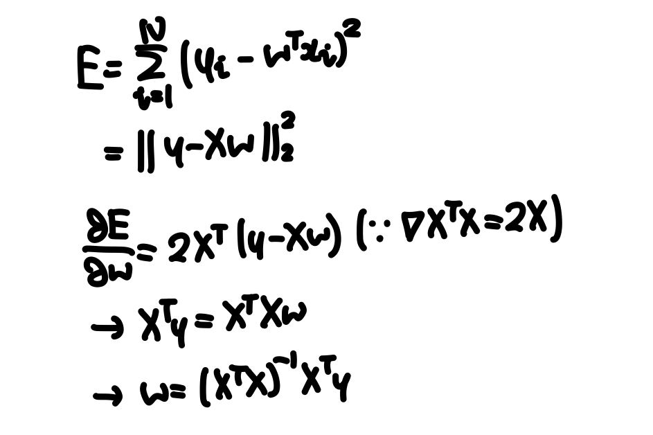

# Linear Regression

## Least Squares Estimation
- Linear regression is the process of minimizing the RSS (residual sum of squares), or the sum of the squared difference between the real value and predicted value.
- This has a closed form solution that can be derived as below.

## References
- https://towardsdatascience.com/derivation-of-least-squares-regressor-and-classifier-708be1358fe9
